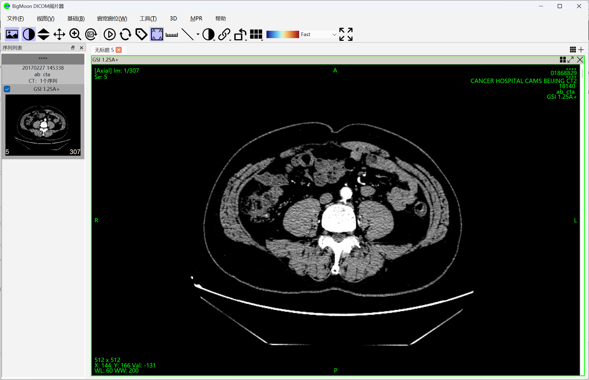
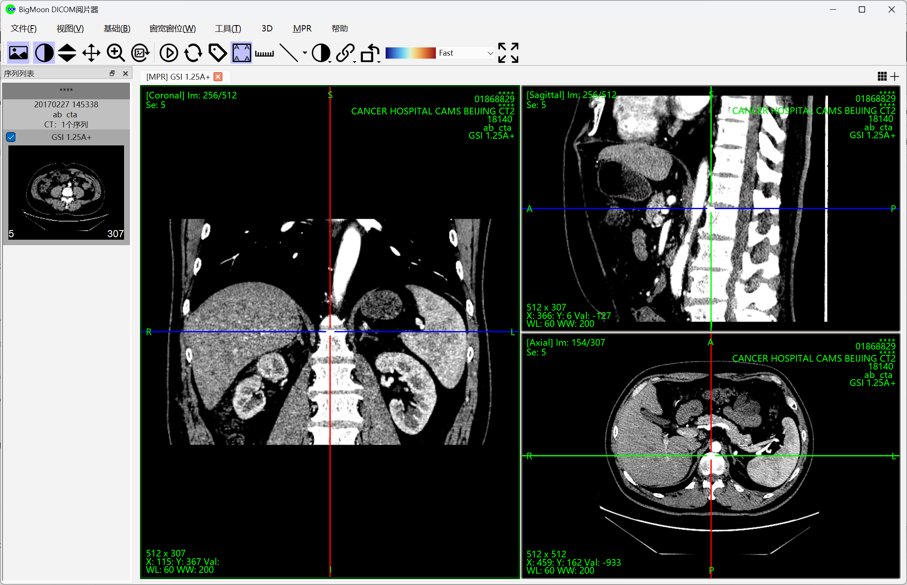
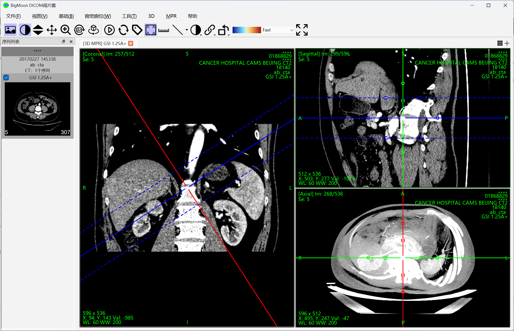
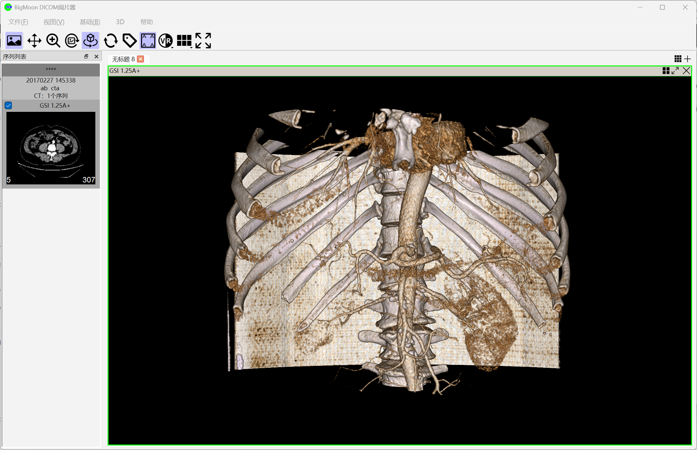
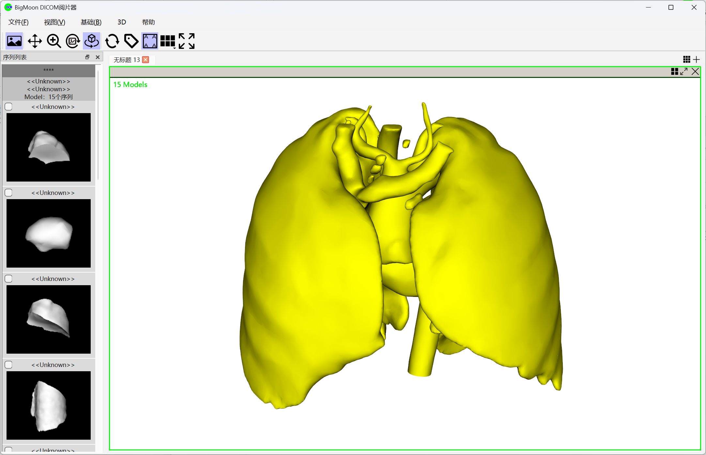
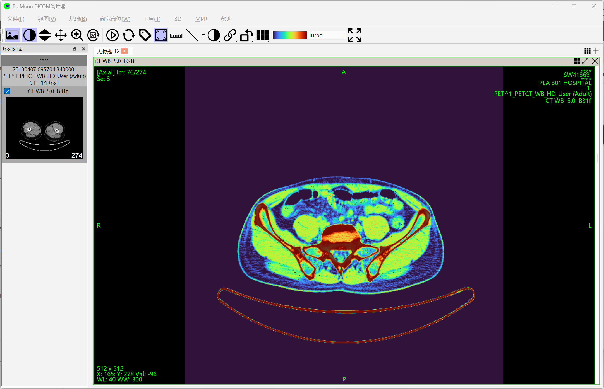
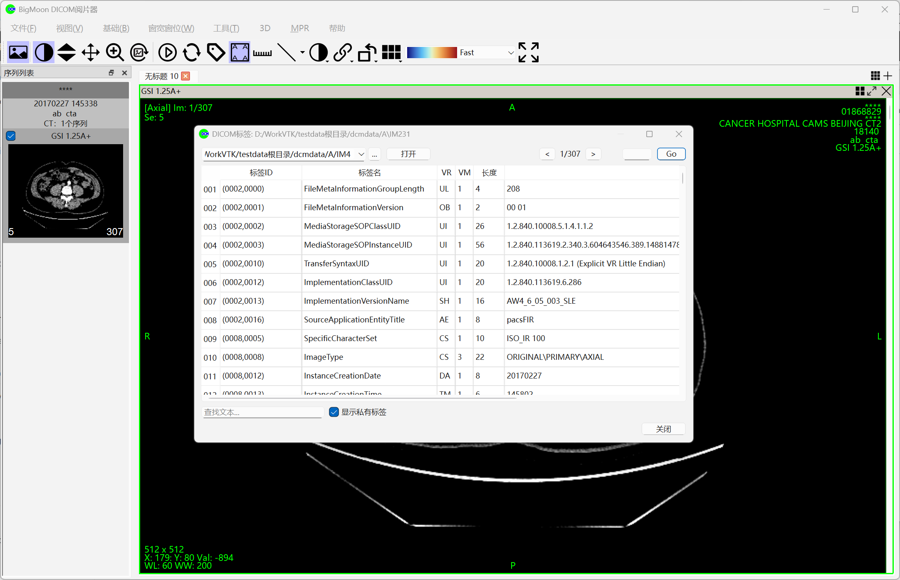
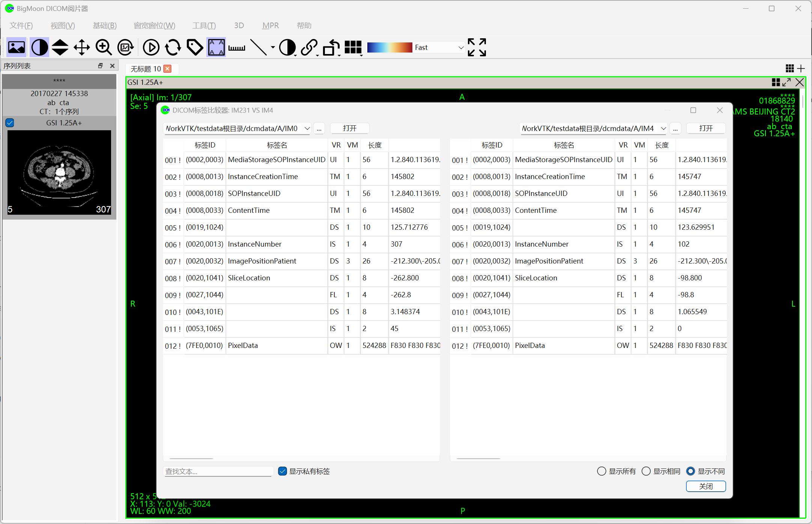
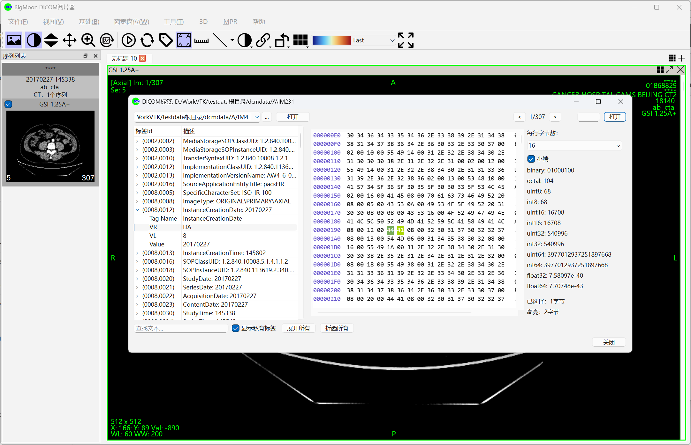

# BigMoon DICOM Viewer
BigMoon DICOM Viewer 是一款综合性的医学影像阅片器。
1. 全面支持各种模态和传输协议的DICOM、NII 和 NRRD等常见格式的图像阅片；
2. 支持STL、OBJ 和 VTK 格式的3D模型数据阅览；
3. 具备高级 3D 可视化（MPR、MIP、VR）功能，支持测量和标注；
4. 支持PACS 查询/检索以及本地数据库管理功能。

# 支持的特征
支持以下功能：
- 支持常见模态（modality）、常见传输语法（Transfer Syntax）的DICOM图像；
- 支持打开NII，NRRD等格式文件；
- 支持打开*.stl, *.obj, *.vtk等常见3D模型格式文件；
- 支持基础交互方式：翻片、平移、旋转、缩放、窗宽窗位；
- 支持自由调整布局方式；
- 支持使用预设值或自定义值调整图像窗宽窗位，支持反色显示，支持伪彩色显示；
- 支持常用的测量标注工具；
- 支持常用的图像增强技术；
- 支持MPR, 3D MPR阅片模式，并支持密度投影（MIP, MinIP, MeanIP, SumIP），且可以自由调整切片厚度；
- 支持3D体渲染（VR），并支持颜色渲染方案切换，且可以切换前/后/左/右/上/下方位;
- 支持查看DICOM图像Tag，支持比较任意两个DICOM图像的Tag差异，支持查阅DICOM标准中的Tag字典库；
- 支持使用DICOM协议搜索并下载DICOM图像；
- 支持使用DICOM图像本地数据库，可以导入、导出或打开DICOM图像；
- 支持截屏并保存到剪贴板，或本地图像文件，或本地pdf文件；
- 支持中英文语言切换；

# 功能截图

## 基础功能

## MPR功能

## 3D MPR功能

## 3D VR功能

## 3D模型功能

## 伪彩色功能

## DICOM Tag功能

## DICOM Tag比较功能

## DICOM Tag检查功能
