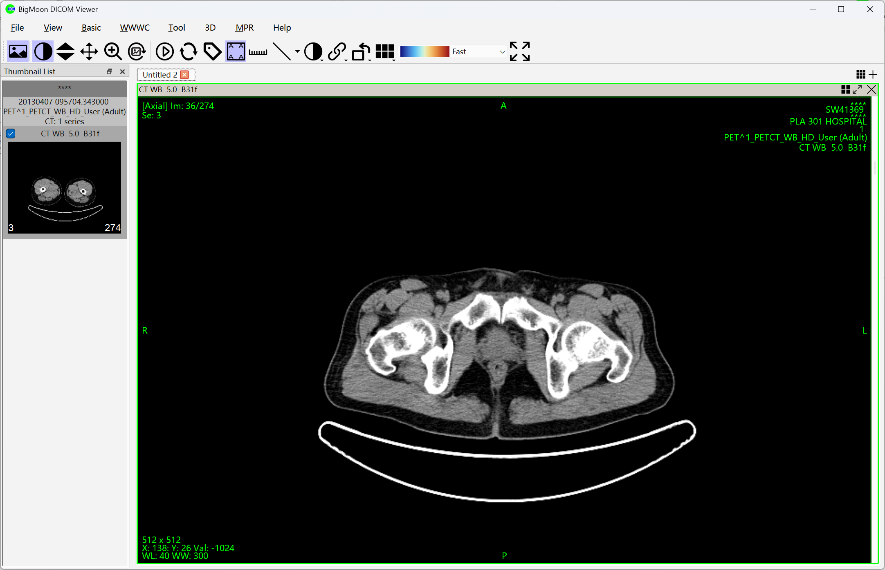
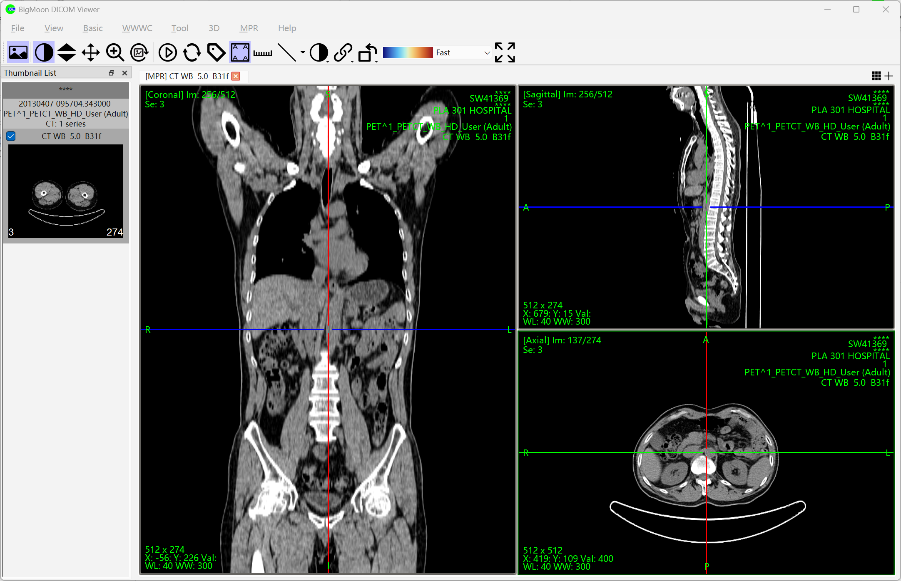
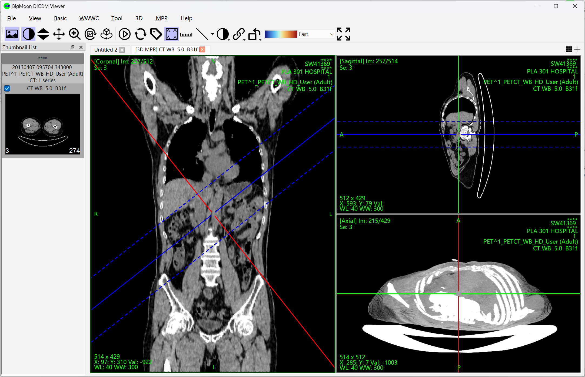
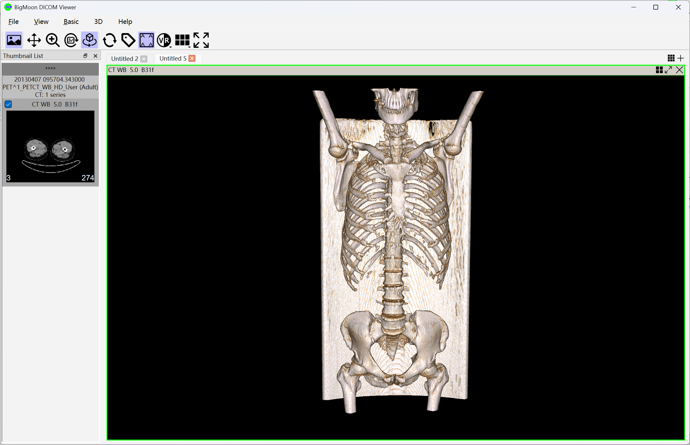
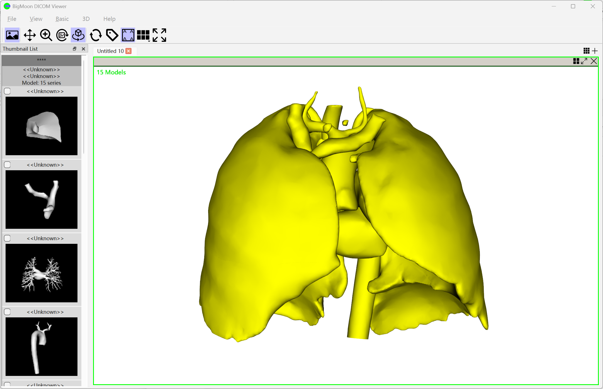
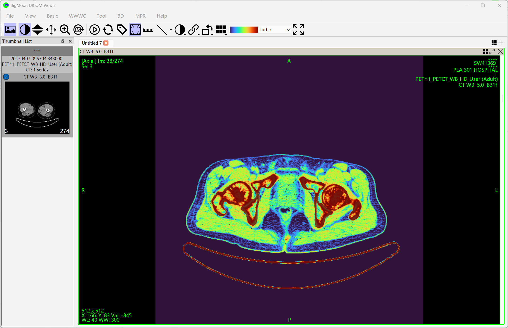
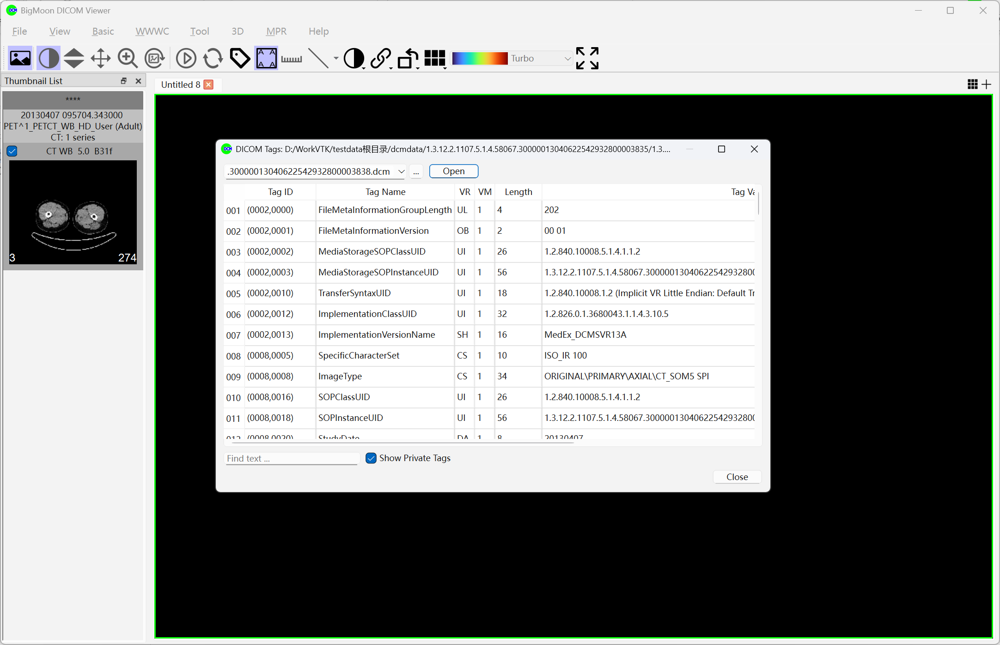
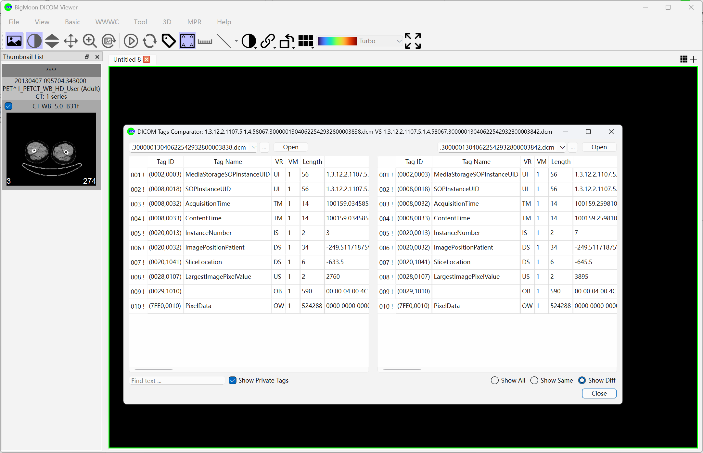
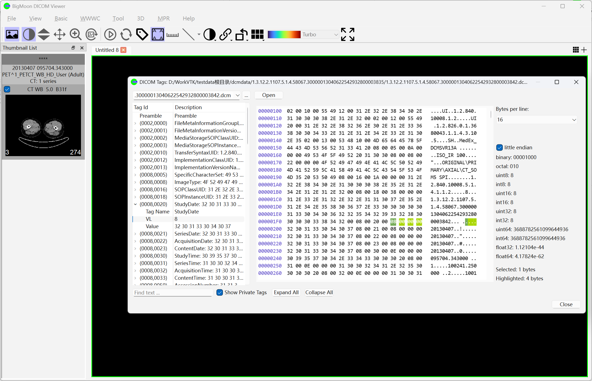

# BigMoon DICOM Viewer
BigMoon DICOM Viewer is a comprehensive medical imaging viewer.
1. Comprehensive support for viewing medical images in common formats such as DICOM, NII, and NRRD, across various modalities and transfer syntaxes;
2. Support for viewing 3D model data in STL, OBJ, and VTK formats;
3. Equipped with advanced 3D visualization functions (MPR, MIP, VR), with support for measurement and annotation;
4. Support for PACS query/retrieval and local database management functions.

# Download Links
- Microsoft Store Deep Link: <a href="ms-windows-store://pdp/?productid=9N2NS0DNN2SQ">Open in Microsoft Store</a>
- Microsoft Store Web Link: <https://apps.microsoft.com/detail/9N2NS0DNN2SQ>
- EXE Installer Download: See the Releases link on the right side of the page

# Supported features
Supporting the following features:
- Supports DICOM images of common modalities and common transfer syntaxes.
- Supports opening file formats such as NII and NRRD.
- Supports opening common 3D model file formats such as *.stl, *.obj, and *.vtk.
- Supports basic interaction methods: frame flipping, panning, rotation, zooming, and window/level adjustment.
- Supports freely adjustable layout configurations.
- Supports adjusting image window/level using preset or custom values, as well as inverted display and pseudo-color display.
- Supports common measurement and annotation tools.
- Supports common image enhancement techniques.
- Supports MPR and 3D MPR viewing modes, along with density projections (MIP, MinIP, MeanIP, SumIP), with freely adjustable slice thickness.
- Supports 3D volume rendering (VR) with switchable color rendering schemes and the ability to change viewing orientations (front/back/left/right/top/bottom).
- Supports viewing DICOM image tags, comparing tag differences between any two DICOM images, and consulting the DICOM standard tag dictionary library.
- Supports searching for and downloading DICOM images using the DICOM protocol.
- Supports a local DICOM image database, allowing importing, exporting, or opening DICOM images.
- Supports screenshot capture and saving to the clipboard, local image files, or local PDF files.
- Supports Chinese/English language switching.

# Feature Screenshots

## Basic Features

## MPR Features

## 3D MPR Features

## 3D VR Features

## 3D Model Features

## Pseudo-color Features

## DICOM Tag Features

## DICOM Tag Comparison Features

## DICOM Tag Inspection Features
